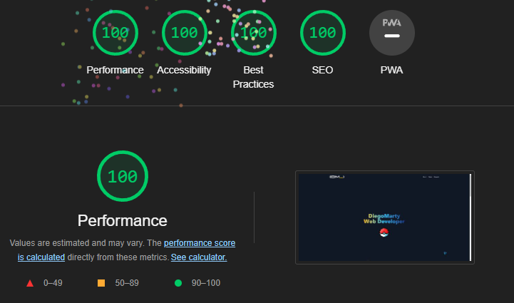
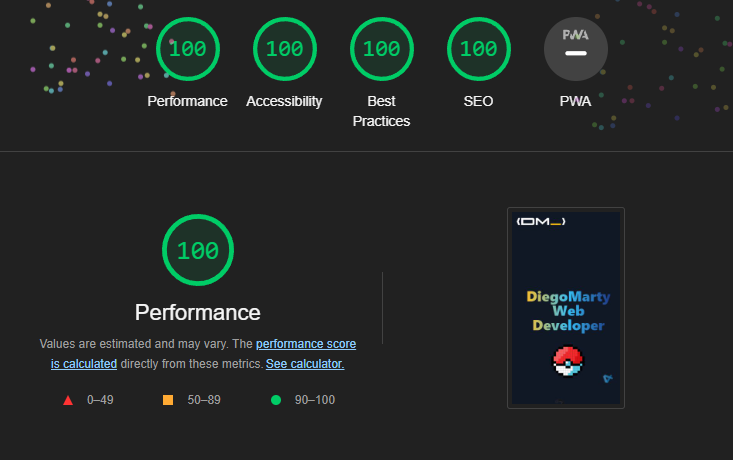

# DiegoMarty Astro.js Web Portfolio y Blog

👉 Porfolio website with personal and contact inforamation, projects showcase and a blog.

- Responsive
- Autogenerate blogs post OG images
- .mdx or .md files for blog
- Comments sections on blog
- Animated background with programing logos
- Animated bubbles on github image profile and personal image
- Socials & Resume
- Buy me a coffe button ( on desktop ) ☕
- Pokefan

Feel free to contribute, open issues or PRs, i like [gitmoji](https://marketplace.visualstudio.com/items?itemName=seatonjiang.gitmoji-vscode) for commits

## 🚀 How to run the project

```bash
npm install
npm run dev
```

## 🏗️ How to compile

```bash
npm run build
```

## 🌐 Hosted on

[Diegomarty.com](https://diegomarty.com)

## 📊 SEO results

### 💻 Lighthouse on Pc



### 📱 Lighthouse on Mobile



## 📁 Estructura de directorios

```bash
├───.github
│   └───workflows
├───.vscode
├───public
│   ├───assets
│   │   ├───posts
│   │   ├───svgs
│   │   └───thumbnails
│   └───icons
│       ├───android
│       └───ios
├───scripts
└───src
    ├───components
    │   ├───about
    │   ├───decoration
    │   ├───particles
    │   ├───posts
    │   ├───projects
    │   ├───stacks
    │   └───utilities
    ├───data
    ├───layouts
    ├───pages
    │   ├───blog
    │   └───open-graph
    ├───posts
    ├───scripts
    └───styles
```
